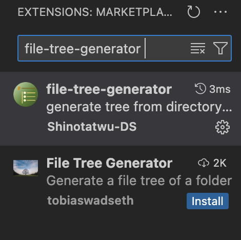
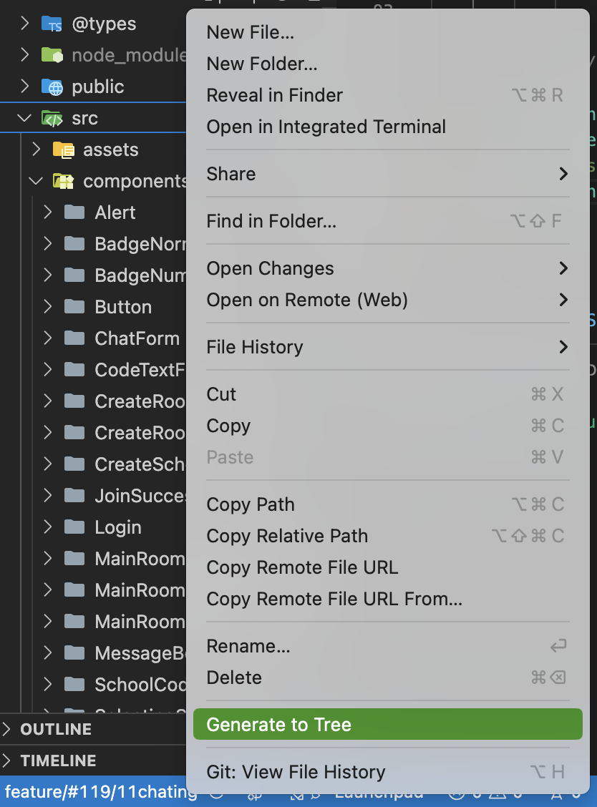
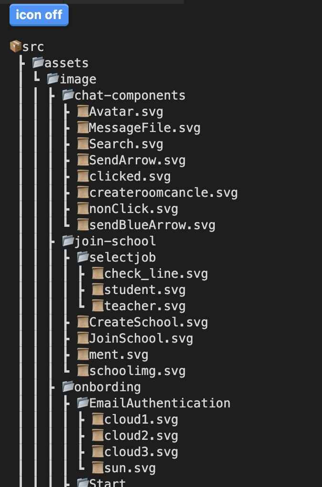
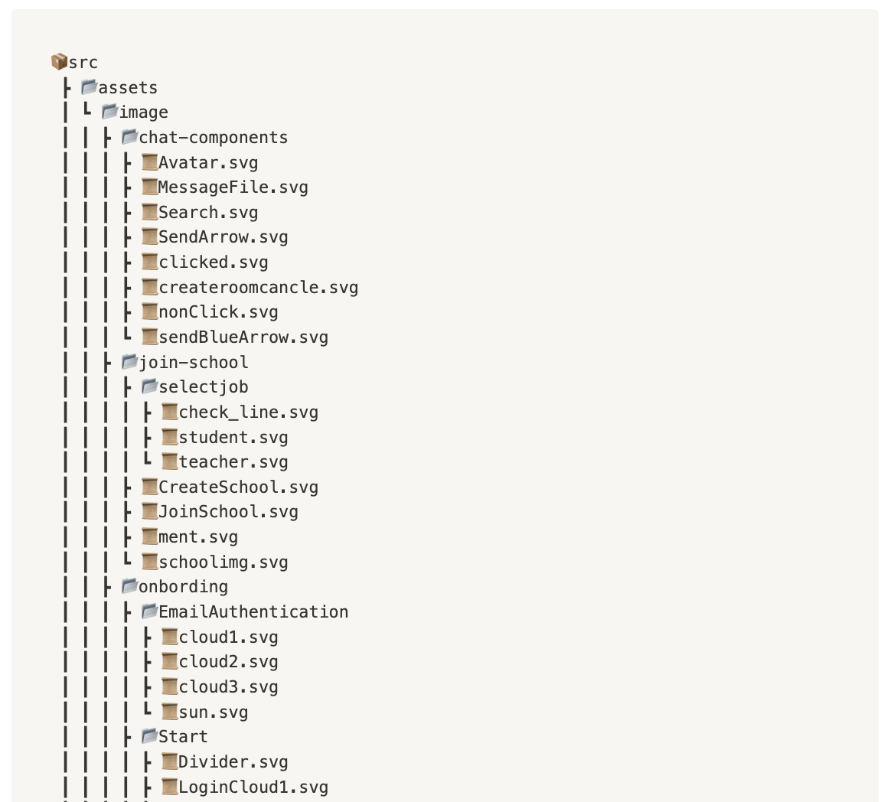

# file-tree-generator

### 1️⃣ file-tree-generator?

꽤 신기한 확장자가 있어서 가져와 봤다

여태껏 README.md 파일에 파일 구조를 옮겨 적을 때  
터미널에서 tree 명령어를 쳐서 나온 결과물을 그대로 복붙해야하는데

노션에 적을 때 너무 불편해서 찾아보다 발견하게 된 vscode extension 이다. 

### 2️⃣ 설치

vscode 의 extenstions 탭에서 file-tree-generator 를 검색하면 나오는 이 친구다.

이제 다 됬는데 내가 트리 구조를 표현하고 싶은 폴더를 우클릭,  
Generate to Tree 하면 완성된다. 

그럼 이런 결과물이 나온다 

icon on/off 기능이 있는데 개인적으로는 한눈에 들어와서 아이콘이 있는게 좋은 것 같다.

취향에 골러서 사용하면 될 듯.

가장 중요한점... 노션에 넣엇을 때 편하고 이쁘다.