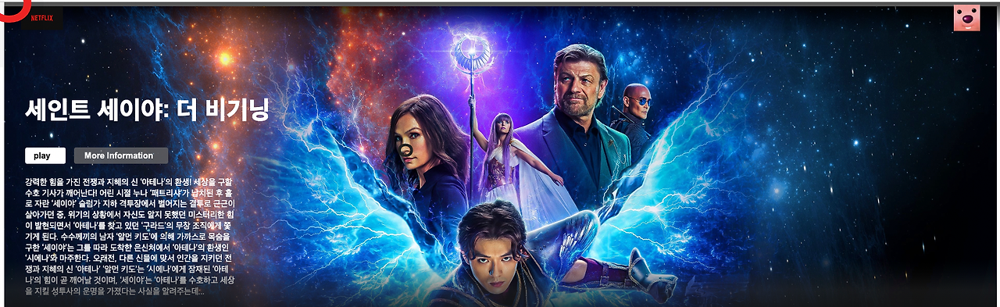

# css reset 초기세팅

### 1️⃣ 구조 분해 할당(Destructuring assignment)이란?
<hr/>

프로젝트를 시작하면, 초기에 먼저 css를 초기화하고 시작하는 것이 좋음 <br/>
이렇게 초기화를 해주는 이유는 **브라우저마다 기본으로 제공하는 스타일**이 있기 때문


예를 들면 <br/>
내가 margin을 지정하지 않았는데도, **알아서 margin값이 들어있어서** *내가 원하는대로 화면을 가득채우는 것이 불가능*하다

아래의 사진은 width를 100%로 주었음에도 불구하고 자세히보면 margin값으로 인해 화면을 가득채우지 못하고 있는 것을 볼 수 있음



그래서 개발자가 의도한대로 디자인이 나오게 하기위해서는 이러한 설정을 다시 리셋해주는 과정을 거쳐야함<br/> 
(프로젝트를 이미 많이 진행하고 난 뒤에 바꾸는 것은 더 어려우므로 프로젝트 초기에 먼저 설정한 뒤 시작하는 것)


### 2️⃣ 원리
<hr/>

단순하게 말하면 

➡️ **user agent stylesheet** 때문에 라고 할 수 있다

### 3️⃣ 해결법
<hr/>

이러한 것을 초기화하기 위해서 상위의 css에 css의 초기값을 입력함

그런데 이러한 과정을 매번 일일이 다 치는 것은 번거로움.
이미 만들어져 있는 라이브러리를 사용하거나, 아니면 짜여진 코드를 가져와서 import해주는 방식으로 해결

이때 대표적으로 사용하는 2가지가 바로 **reset css / normalize css**

**reset css:** <br/> 
거의 다 초기화되어 개발자 맘대로 만들 수 있고 가볍다

**normalize.css:** <br/> 
이름처럼 정규화를 시켜준다고 이해하면 됨. <br/> 
어느정도 초기화되지만 기본적은 디자인은 내장함

다른 브라우저로 보더라도 일정한 디자인을 볼 수 있도록 해주기위해서 사용

reset.css보다는 조금 더 무겁고 최근 더 많이 사용된다고 함

➡️ 내가 디자인을 다 하고 싶다면 reset.css, 기본적인것이 조금은 가미된 것을 쓰고 싶다면 normalize를 사용하면 됨.

### 4️⃣ 사용
<hr/>

### reset css

1-1. cnd <br/> 
index.html의 <head>태그 안에 cdn을 import

```
<link
      rel="stylesheet"
      href="https://cdn.jsdelivr.net/npm/reset-css@4.0.1/reset.min.css"
    />
```

1-2. reset.css 파일

https://meyerweb.com/eric/tools/css/reset/ 

이 페이지에서 전체 코드 복사 후 <br/> 
reset.css라는 파일을 만든 후<br/> 
복사한 해당 코드를 reset.css에 붙여넣음

app.css에 reset.css를 import
```
@import "./reset.css"
```
(각자 저장한 위치에 알맞게 경로를 지정해야함!!!!!!)


### normalize.css 

2-1. cdn이용

reset.css를 index.html에 넣은것과 같이, index.html의 태그 안에 cdn을 import

```
 <link
      rel="stylesheet"
      href="https://cdnjs.cloudflare.com/ajax/libs/normalize/8.0.1/normalize.min.css"
    />
```
https://cdnjs.com/libraries/normalize 

2-2. 터미널에서 install

```
npm i normalize.css
```

