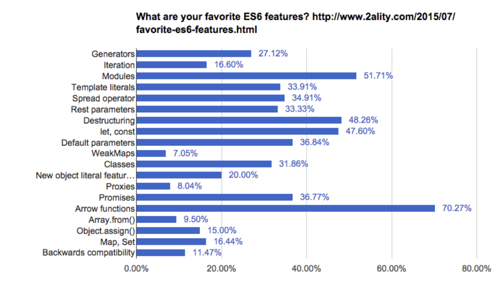

# 화살표 함수(Arrow Function)

### 1️⃣ 높은 수요
<hr/>



### 2️⃣ ES5이전의 함수, 화살표 함수의 차이
<hr/>

가장 큰 차이 -> this

```
var Dog = function() {
  this.think = "집가고싶당헤헤";
  this.say = () => this.think;
};

var a = new Dog();
a.say();
```

- 생성자로 호출될 수 없음.

- arguments가 없음

- prototype 프로퍼티를 가지지 않음.

- yield 키워드를 사용할 수 없다고 함.

`- The yield keyword may not be used in an arrow function's body (except when permitted within functions further nested within it). As a consequence, arrow functions cannot be used as generators.`

```
var func = () => { foo: 1 };
// Calling func() returns undefined!

var func = () => { foo: function() {} };
// SyntaxError: function statement requires a name
```

```
let callback;

callback = callback || function() {}; // ok

callback = callback || () => {};
// SyntaxError: invalid arrow-function arguments

callback = callback || (() => {});    // ok
```

### 3️⃣ How Much Use Is There for Arrow Functions?
<hr/>

1. Use function in the global scope and for Object prototype properties.
2. Use class for object constructors.
3. Use => everywhere else.

라고 한다~!

### 4️⃣ 화살표 함수 객체지향 프로그래밍 불가
<hr/>

프로토 타입 상속으로 -> 
```
var Parent = function() {};
Parent.prototype.wrap = function() {
  this.action();
};
Parent.prototype.action = function() {
  console.log("parent");
};
var Child = function() {
  this.action = () => {
    console.log("Child");
  };
};

Child.prototype = Object.create(Parent.prototype);
Child.prototype.constructor = Child;

var a = new Child();
a.action();
a.wrap();
```

화살표 함술로 -> 
```
var Parent = function() {
  this.wrap = () => this.action();
  this.action = () => console.log("Parent");
};
var Child = function() {
  this.action = () => {
    console.log("Child");
  };
};

Child.prototype = Object.create(Parent.prototype);
Child.prototype.constructor = Child;

var a = new Child();
a.action();
a.wrap();
```

```
var Parent = function() {};
Parent.prototype.wrap = function() {
  this.action();
};
Parent.prototype.action = function() {
  console.log("parent");
};
var Child = function() {
  this.action = () => {
    console.log("Child");
  };
};

Child.prototype = Object.create(Parent.prototype);
Child.prototype.constructor = Child;

var a = new Child();
a.action();
a.wrap();
```

