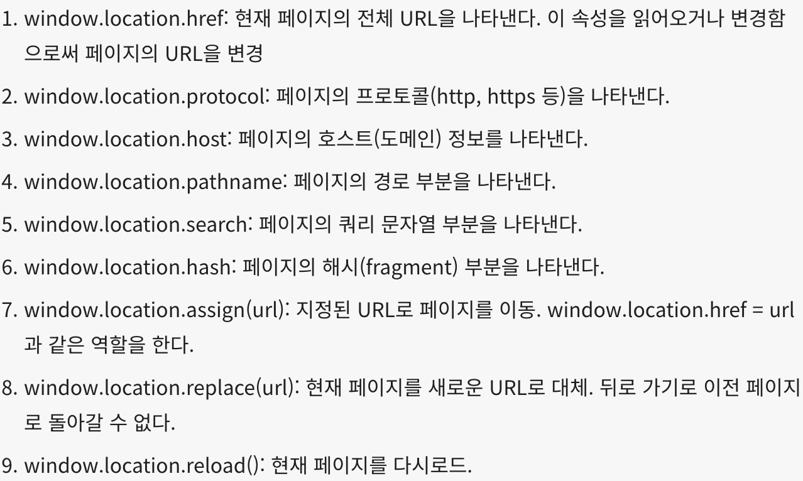

# 현재페이지 리로드

### 1️⃣ window.location.reload()
<hr/>

현재 페이지를 다시 리로드하는 기능을 구현하기 위해서 window.location.reload를 사용

### 2️⃣ 방법
<hr/>

```
 window.location.reload()}
      />
```

이런 식으로 이미지를 누르면 윈도우가 리로드 되는 화면을 만들 수 있다.

onClick이벤트를 통해 이미지를 누르면 reload를 실행하게 한다.

### 3️⃣ 원리
<hr/>

window.location은 웹 브라우저의 JavaScript 객체, <br/>
현재 브라우저 창의 주소(혹은 URL)와 관련된 정보를 제공하고 조작할 수 있는 속성(property)

이 객체를 통해 현재 페이지의 URL을 확인하거나, 새로운 URL로 이동하거나 페이지를 다시로드할 수 있음



https://developer.mozilla.org/en-US/docs/Web/API/Window/location 


### 4️⃣ 유의점
<hr/>

window.location.reload()를 호출하면 **현재 페이지의 모든 상태와 데이터**가 초기화, **사용자의 입력에 의해 변경된 내용**도 모두 사라짐