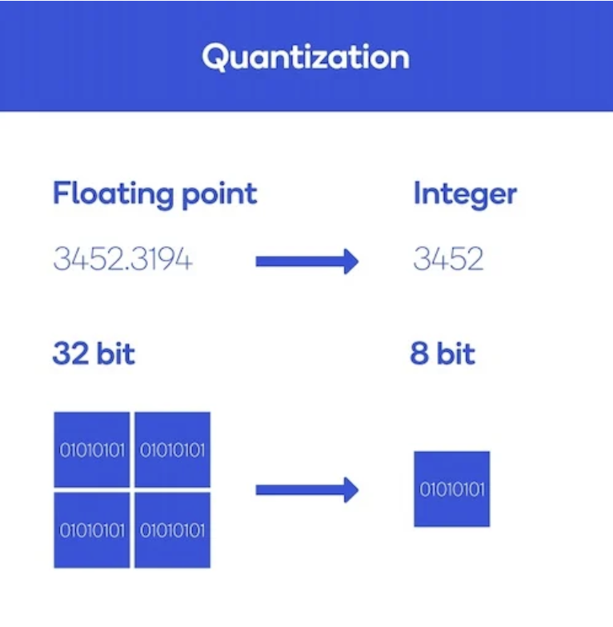
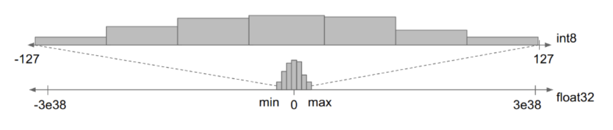
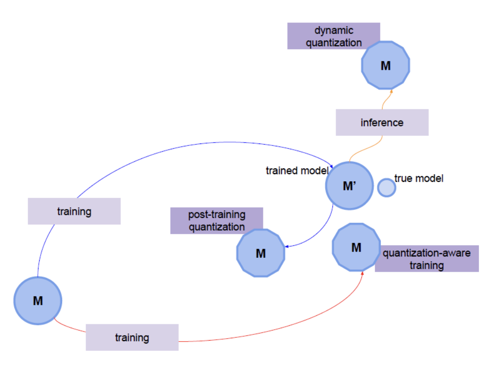

# Quantization, 양자화

### 1️⃣ 양자화(Quantization)란?
<hr/>

양자화란, 모델의 실행 성능과 효율성을 향상을 위해 `신경망의 가중치(weight)와 활성화 함수(activation function) 출력을 더 작은 비트 수로 표현하도록 변환하는 기술`을 말한다. 



이는 신경망의 모델 크기를 줄이고, 계산 속도를 높이며, 메모리 사용량을 감소시켜 효율적인 모델 배포와 실행을 가능하게 해주는 중요한 방법!!!!

`양자화의 주요 목표는 모델을 손상시키지 않으면서 모델의 크기를 줄이고 계산 비용을 낮추는 것`

여기서 양자화는 가중치, 활성화 함수의 파라미터 값을 정수나 적은 비트 수로 표현하거나, 연산 중에 정밀도를 감소시켜 계산 복잡성을 낮추는 방식으로 이루어짐.

 보통 tensorflow나 pytorch의 파라미터는 보통 32비트 부동 소숫점 연산, **fp32(FLOAT32)** 의 형태로 저장. 
 
 이 모델의 파라미터를 lower bit로 표현하여, **8비트 정수(int8)** 로 저장하는 것

**정밀도가 더 낮은 비트 수로 표현해서 얻는 이점??**
- 모델 크기 4배 감소
- 메모리 대역폭 2-4배 감소
  - 32비트에서 8비트로 이동해서, 메모리가 4배 감소
- 메모리 대역폭 절약 및 int8 산술을 통한 더 빠른 계산 -> <br/> 2-4배 더 빠른 추론이 가능 (정확한 속도 향상은 하드웨어, 런타임 및 모델에 따라 다름)

**문제점의발생**



int8에 매핑된 작은 범위의 float32 값은 int8에 255개의 정보 채널만 있기 때문에 손실 변환

 양자화는 작은 범위의 부동 소수점 값을 고정된 수의 정보 버킷으로 압축한다.

 이 압축되는 과정에서, **채널의 수가 줄어드는 만큼 정보가 손실** 된다. 모델의 매개 변수나 가중치는 이제 작은 값 집합만 취할 수 있으며 이들 사이의 미세한 차이가 손실 ㅜㅜㅜㅜㅜㅜㅜ

### 2️⃣ 왜 씀? 
<hr/>

```
1. 모바일 기기나 에지 디바이스와 같이 계산 자원이 제한적인 환경에서 사용

2. 실시간 추론이 필요한 시스템에서 빠른 모델 실행 속도를 요구할 때 사용

3. 대규모 모델을 배포하거나 저장할 때 메모리 사용량을 줄이는데 도움
```

### 3️⃣ 종류
<hr/>



1. 동적양자화 Dynamic Quantization 
- **미리 학습된** 모델의 가중치와 활성화 함수의 비트 수를 줄이는 기법
- **런타임 시 양자화** 되며, 가중치와 활성화 함수의 분포에 따라 크기가 다양하게 조절
- 인퍼런스 중 성능 저하가 덜 발생하며, 변환 비용이 낮음

2. 정적양자화 Static Quantization 
- **훈련 후**, 가중치와 활성화 함수의 비트 수를 줄이는 기법
- 가중치와 활성화 함수의 분포를 분석하여 고정된 양자화 스케일과 오프셋을 결정하고 모델을 양자화
- 인퍼런스 시 성능 저하가 발생할 수 있음

3. 양자화 인식 교육 Quantization aware training
- **훈련 중**에 양자화를 고려하여 **모델을 조정**하는 기법
- `가중치 양자화에 대한 학습을 포함하여 원본 모델을 보다 양자화에 robust하게 만듦`
- 일반적으로 인퍼런스 시 성능 저하가 적음