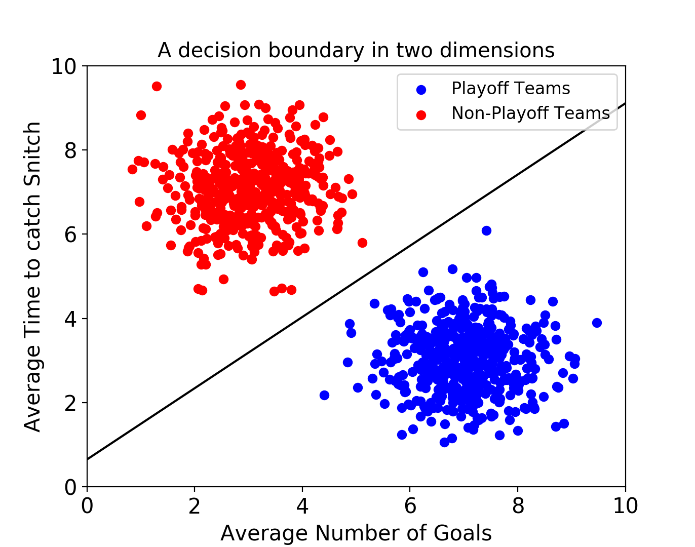
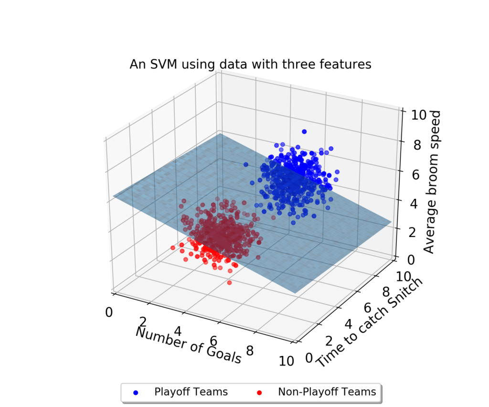
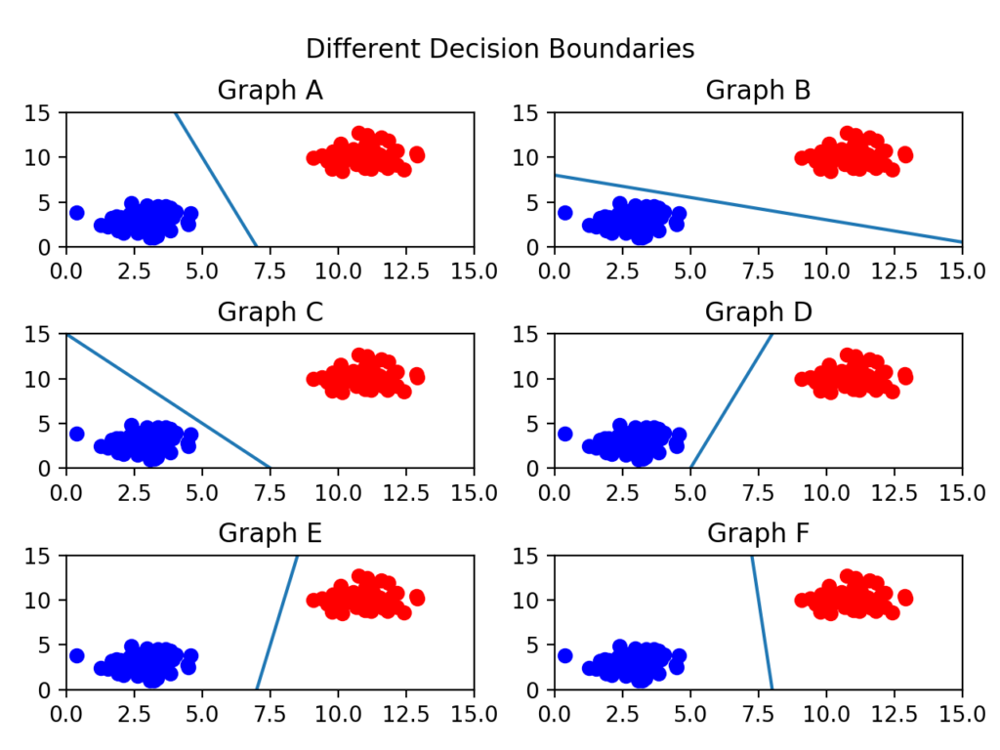
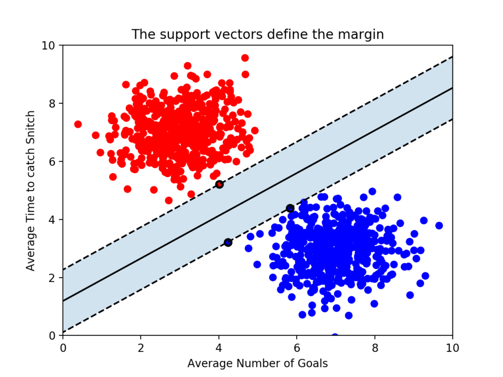
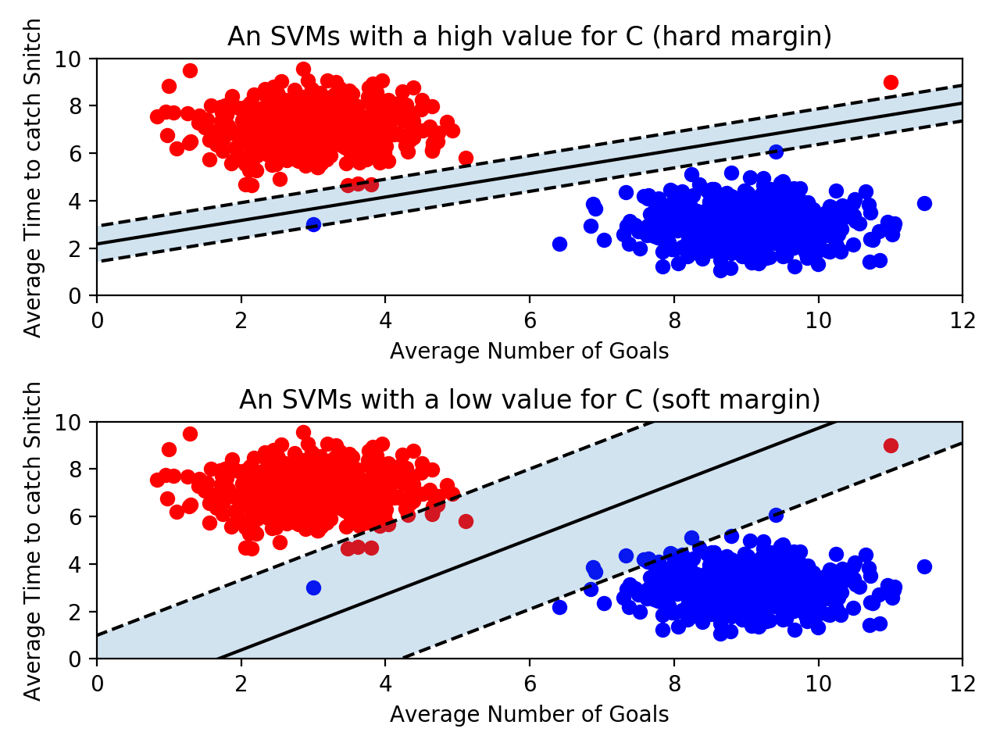
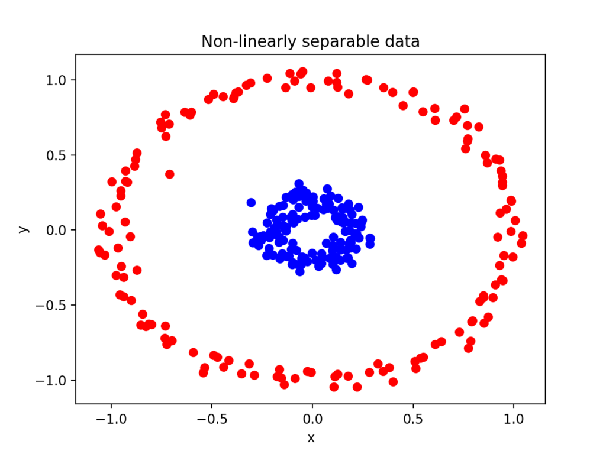

# SVM이 뭘까?

### 1️⃣ SVM
<hr/>
SVM은 Support Vector Machine의 약자로 서포트 벡터 머신이다.

*그럼 SVM이 뭘까?*
<br><br>
**서포트 벡터 머신(이하 SVM)은 결정 경계(Decision Boundary)**, 즉 분류를 위한 기준 선을 정의하는 모델이다.

그래서 분류되지 X or 새로운 점이 나타나면 어느 쪽에 속하는지 확인해서 분류 과제를 수행할 수 있다.

따라서 결국 이 `결정 경계라는 걸 어떻게 정의하고 계산하는지 이해하는게` 더 중요하다는 뜻이다.


우선 데이터에 2개 속성(feature)만 있다면 결정 경계는 이렇게 간단한 선 형태가 나오게 된다. 

하지만 속성이 3개로 늘어난다면 이렇게 3차원으로 그려야만 한다.



그리고 이 때의 결정 경계는 **선이 아닌 평면**이 된다.

우리가 이렇게 시각적으로 인지할 수 있는 범위는 딱 3차원까지다.<br/>
결정 경계도 단순한 평면이 아닌 고차원이 되고, 이를 `"초평면(hyperplane)"`이라고 부른다.


### 2️⃣ 최적의 결정 경계(Decision Boundary)
<hr/>



**결정 경계는 데이터 군으로부터 최대한 멀리 떨어지는 게 좋다**는 걸 알 수 있다.
실제로 서포트 벡터 머신(Support Vector Machine)이라는 이름에서 **Support Vectors는 결정 경계**와 가까이 있는 데이터 포인트들을 의미한다.

`이 데이터들이 경계를 정의하는 결정적인 역할을 하는 셈이다!@@!!`

### 3️⃣ 마진(Margin)
<hr/>

**마진(Margin)은 결정 경계와 서포트 벡터 사이의 거리**를 의미한다.


가운데 실선이 하나 그어져있는데, 이게 바로 '결정 경계'가 이다. 이 점선으로부터 결정 경계까지의 거리가 바로 '마진(Margin)'이다.

따라서 **최적의 결정 경계는 마진을 최대화**한다.

그리고 위 그림에서는 x축과 y축 2개의 속성을 가진 데이터로 결정 경계를 그었는데, 총 3개의 데이터 포인트(서포트 벡터)가 필요했다. 즉, **n개의 속성을 가진 데이터에는 최소 n+1개의 서포트 벡터가 존재한다는 걸 알 수 있다.** 

`SVM에서는 결정 경계를 정의하는 게 결국 서포트 벡터이기 때문에 데이터 포인트 중에서 서포트 벡터만 잘 골라내면 나머지 쓸 데 없는 수많은 데이터 포인트들을 무시할 수 있다. !!!!!그래서 매우 빠르다.`

### 4️⃣ 이상치(Outlier)를 얼마나 허용할 것인가
<hr/>



- 위의 그림은 아웃라이어를 허용하지 않고 기준을 까다롭게 세운 모양이다. 이걸 **하드 마진(hard margin)** 이라고 부른다. 즉, 마진이 매우 작아진다. 이렇게 개별적인 학습 데이터들을 다 놓치지 않으려고 아웃라이어를 허용하지 않는 기준으로 결정 경계를 정해버리면 오버피팅(overfitting) 문제가 발생할 수 있다.

- 아래 그림은 아웃라이어들이 마진 안에 어느정도 포함되도록 너그럽게 기준을 잡았다. 이걸 **소프트 마진(soft margin)** 이라고 부른다. 즉, 마진이 커진다. 대신 너무 대충대충 학습하는 꼴이라 언더피팅(underfitting) 문제가 발생할 수 있다.

### 5️⃣ 커널(Kernel)
<hr/>



빨간색 점을 파란색 점과 분리하는 직선을 그릴 수가 없다!! 오 노.. ㅠㅜ

그러나 다행히도 scikit-learn에서는 SVM 모델을 만들 때 kernel을 지정하여 해결할 수 있다!!!!!!


```
from sklearn.svm import SVC

classifier = SVC.(kernel = 'liner')
```

보통은 이렇게 선형(linear)으로 지정한다.  

--> 따라서 `SVM에서는 선형으로 분리할 수 없는 점들을 분류하기 위해 커널(kernel)을 사용한다.` 라고 보면 된다. 
