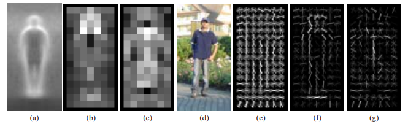
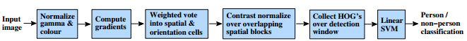
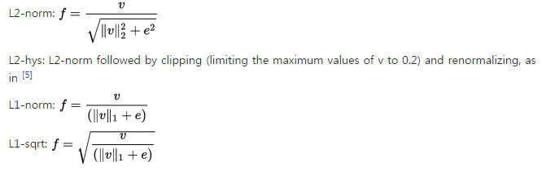

# HOG?
### 1️⃣ HOG란

HOG Algorithm은 일반적으로 보행자 검출이나 사람의 형태에 대한 검출 

즉, `Object Tracking`에 많이 사용되는 Feature 중 하나!

**Image의 지역적인 Gradient를 해당 영상의 특징**으로 사용하는 방법이다. 

**Edge의 양과 방향을 구분하는 특성**을 가지고 있다. 
또, `Overlap`을 이용하여 계산하기 때문에 어느 정도 Shift에도 적응할 수 있는 능력이 있다. 

마치 Haar-like가 영역으로 특징을 구하기 때문에 잡음에 둔감한 것과 같이 HOG의 Overlap의 이유는 어느정도의 변화를 받아 들일 수 있다는 것

### 2️⃣ 수행방법

Edge Orientation Histograms의 방법과 유사

 영상에서 Gradient를 계산하고 계산 된 값을 이용하여 Local Histogram을 생성한다. 이렇게 생성된 Histogram을 이여 붙여 1차원 vector를 생성

 HOG 알고리즘에서는 아래와 같은 Mask(Derivative mask)를 사용
 
  `1차원 vector를 생성하기 위해 discrete derivative mask를 사용`하는데, 수평적, 수직정 방향 둘 다 적용하게 되고, filtering된 color와, data의 intensity가 필요

   x 축 방향 에지와 y축 방향 에지를 계산한 뒤, 두 값을 이용하여 Orientation을 계산
   
   이렇게 계산된 Orientation은 360개가 넘게 되는데, 40도 단위로 나뉘는 9개의 bin이나 24도 단위로 나누는 15개의 bin을 사용하여 `Quantization(양자화)`한다. 
   
   Block normalization은 다음과 같은 식에 의해 수행된다.
   
 v는 비정규화된 벡터다. ||v||k는 k-norm(k=1,2), 그리고 e는 어떤 작은 constant(exact value) 
 
 normalization factor는 다음 네가지 중 하나로 수행된다. 

 Cell 별로 Histogram을 만드는데 Orientation을 몇 개의 bin으로 나누었냐에 따라서 index 설정,  이런 식으로 모든 Cell에 대해 histogram을 생성