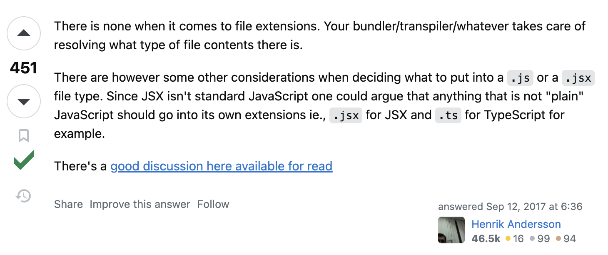

# 리액트 .js vs .jsx 차이

### 1️⃣ JSX란?
<hr/>
JSX는 JavaScript XML의 약자

 자바스크립트에서 XML을 추가한 확장형 문법. 
 
 큰 특징은 **자바스크립트에서 HTML 문법을 사용할 수 있다**는 점, 주로 리액트나 다른 프론트엔드 프레임워크에서도 사용이 가능

 공식 문서에서 설명하기로는 UI 관련 작업을 위해 권장이 되며 React에서 에러, 경고 메세지를 표시해준다고 함.

 ```
 // JSX
render() {
  return (
    <TestButton>
        Click here
    </TestButton>
   )
}
 ```
 JSX 코드는 자바스크립트 컴파일러인 @babel을 통해 javascript로 변환

 ```
 // JS
React.createElement(
	"button",
  {className: "sidebar"}
)
 ```

 리액트에서는 JSX를 자바스크립트로 변환하기 때문에 javascript 문법을 사용하기 위해선 따로 mark
 
  따라서 JavaScript를 JSX 내부에서 사용할 때에는 `중괄호`를 사용해야 한다.


### 2️⃣ .js vs .jsx
<hr/>


https://stackoverflow.com/questions/46169472/reactjs-js-vs-jsx 

위 사진은 스택오버플로우의 글이다. 



이 답변은 가장 많은 추천수를 받았는데

내용은 `'확장자로서의 차이가 없다'`라는 것

하지만 JSX는 자바스크립트 표준 문법이 아니기에 논쟁이 있을 수 있다고 함.

하지만 위의 JSX 설명에서 보았듯이 어차피 리액트로 작성한 코드들은 자바스크립트로 변환됨

 따라서 컴포넌트 파일을 만들어 사용하는 리액트의 JSX 관련 코드는 `.jsx`로 만들고 나머지 일반 JavaScript 코드들은 `.js`로 만들면 된다.


### 3️⃣  .ts vs .tsx
<hr/>

자바스크립트 외에 타입스크립트의 경우, `.ts`와 `.tsx` 확장자로 사용

`.tsx` 에서는 JSX 문법을 사용할 수 있지만
`.ts`는 JSX 문법이 불가능하다. 오직 TypeScript만 사용 가능