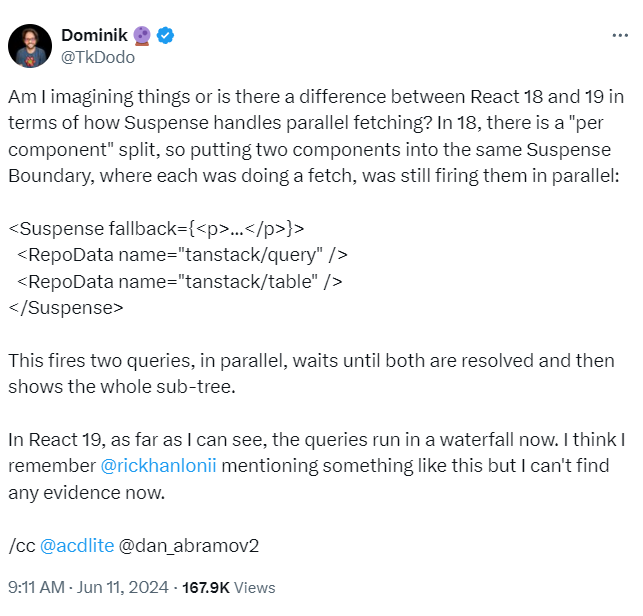
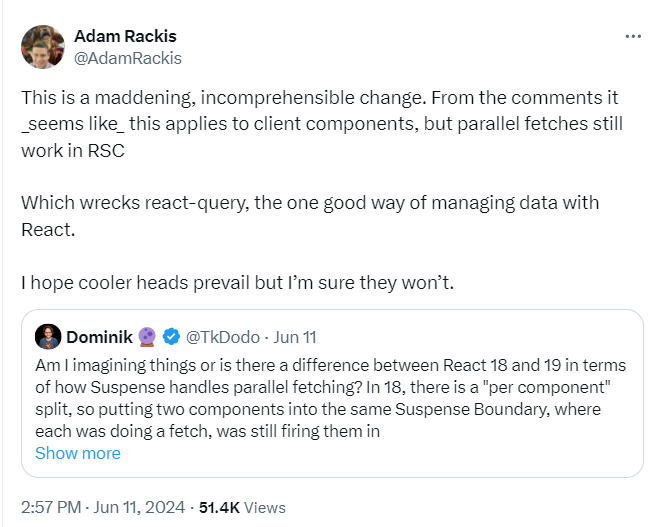
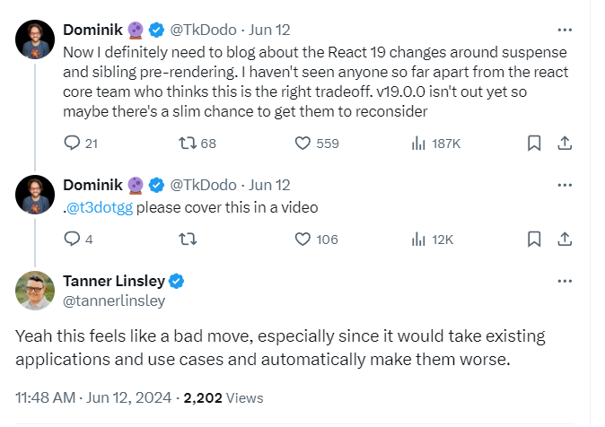
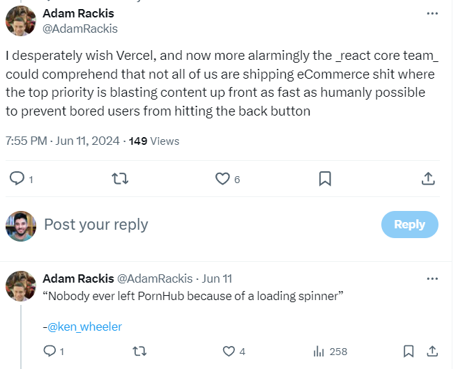
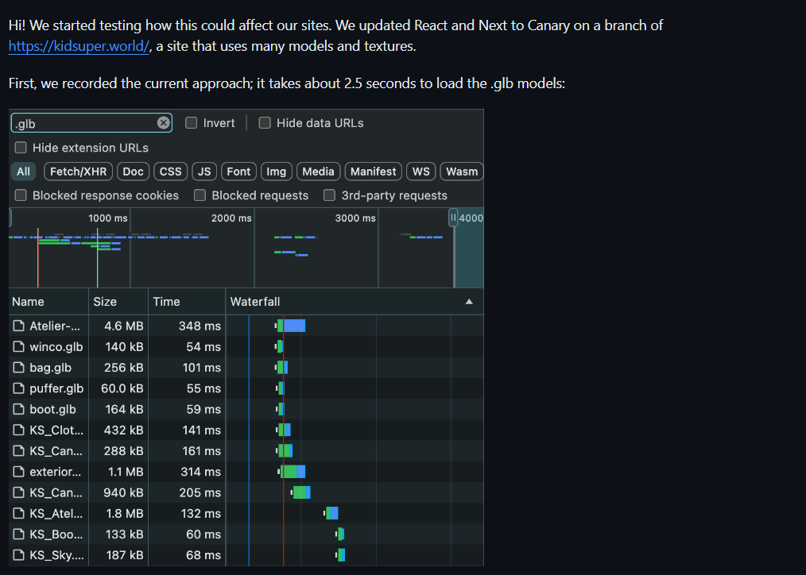
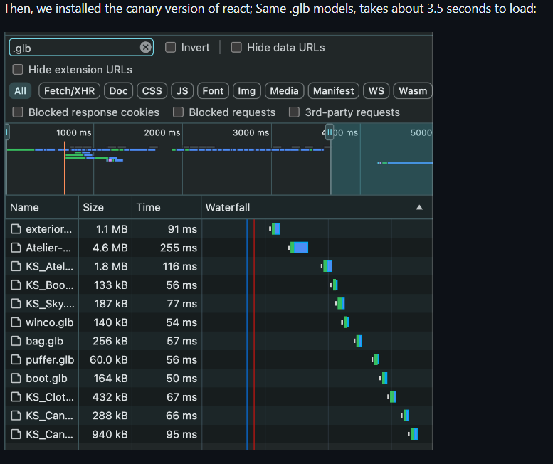
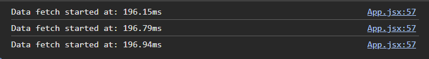
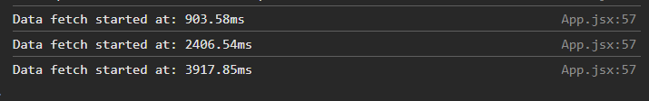
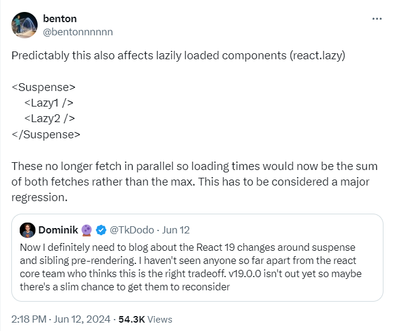
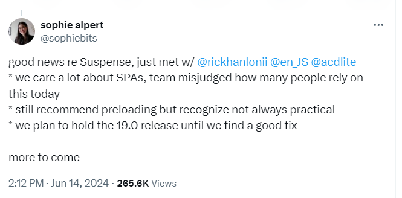

# React 19?


원문 -->  

https://blog.codeminer42.com/how-react-19-almost-made-the-internet-slower/

`React는 여전히 가장 인기 많고 많이 사용되는 UI 프레임 워크`이다~~ <br/>
(Netflix, Airbnb, Discord는 물론 React의 탄생지인 Meta(Facebook, Instagram 및 Whatsapp)와 같은 유명 웹 이름을 지원 하는 것 처럼...)

React가 수십억 명의 사람들이 사용하는 사용자 인터페이스를 만드는 데 사용된다는 점을 고려하면, 

모든 인터넷 트래픽의 상당 부분이 React에 의해 "처리"된다고 가정하는 것이 합리적이다.


올해 초 많은 기대를 모았던 `React 19가 발표되었지만 눈부신 새로운 기능과 DX 개선 사항과 함께` 지난 주 까지 눈에 띄지 않았던 작은 변화가 나타났다.

모든건 하나의 트윗에서 시작되었는데...


https://x.com/TkDodo/status/1800501040766144676

```
“그냥 제 상상인가요? 아니면 Suspense가 병렬 패칭을 다루>는방식에서 리액트 react18과 react19에 차이가 있나요?
18버전에서는 “컴포넌트별로“ 분할을 해줘서
두 컴포넌트를 같은 Suspense 안에 두면,
각각 fetching을 해도 병렬로 실행되었어요.

<Suspense fallback={<p>...</p>}>
 <RepoData name="tanstack/query" />
 <RepoData name="tanstack/table" />
</Suspense>

이렇게하면 두개의 쿼리가 병렬실행되고
두 쿼리(fetch)가 다 끝나고나서
전체 하위컴포넌트가 보여졌어요.

내가 본걸로는 react19 에서는
이제 쿼리가 하나씩만 실행됩니다.
제기억에 rickhanlonii님이 이런 언급을 했던적이
있는거같은데 지금은 증거를 못찾겠습니다. “
```

라는 이야기이다.

그 후 상당한 반응이 이어졌다.


https://x.com/AdamRackis/status/1800588094560772224 


https://x.com/tannerlinsley/status/1800903098464096664 


https://x.com/AdamRackis/status/1800663066922963264 

<hr/>

`Dominik(AKA TkDodo)` 가 누구냐면 그는 전설적인 `Tanner Linsley` 와 함께 널리 사용되는 `TanStack Query` 의 핵심 관리자 중 한 명

하지만 여기서 주요 주제로 돌아가서 논의되고 있는 변경 사항은 React 19가 동일한 Suspense 경계 내에서 형제의 병렬 렌더링을 비활성화한다는 것입니다 . 이는 기본적으로 이러한 형제 내부에서 가져온 데이터에 대한 데이터 가져오기 폭포를 도입합니다.

하지만 여기서 react19에서 논의 되고 있는 변경 사항은 
동일한  Suspense boundary 안에서 형제 요소들의 병렬 렌더링을 비활성화 한다는 것이다. 

++그리고 이것은 필수적으로 이 형제 요소들이 안에 패치된 데이터들에 대한 워터풀 현상을 야기한다.



이게 어떻게 우리 사이트들에 영향을 주는지 실험,

우리는 리엑트와 넥스트를 Canary버전으로 업데이트. 이 사이트는 많은 모델들과 텍스쳐들을 사용합니다.


첫번째로, 우리는 현재의 접근시간을 기록했습니다.

.glb 모델들을 로드하기까지 약 2.5초 소요



canary 버전을 다운받고 다시 테스트

똑같은걸 로드하는데 약 3.5초가 걸렸습니다.

https://github.com/facebook/react/pull/26380#issuecomment-2166178673


이번 일에서 가장 최악인 건 이 변화가 이러한 패턴 사용 유저에게 영향을 미칠 것인데 

이 변경사항에 대해 언급하는게 `한줄의 글머리 기호 뿐이라는 것!`

<br/>

### Suspense 요약

이것을 모두 이해하기 위해서는, 먼저 react suspense에 대해서 빠르게 요약할 필요가 있음

Suspense는 자식 컴포넌트가 지연 로딩 중이거나 Suspense가 활성화된 데이터 불러오기 메커니즘을 사용하고 있기 때문에 자식 컴포넌트의 로딩이 완료될 때까지
폴백을 표시할 수 있는 리액트 컴포넌트임.

```
<Suspense fallback={<Loading />}>
  <ComponentThatFetchesDataOrIsLazyLoaded />
</Suspense>
```

이러한 방식으로 사용됨

Suspense는 오래동안 리액트 API의 일부였는데, 오랫동안 컴포컨트를 **지연 로드** 하기 위해 공식적으로 허락된 방법은 `React.lazy`를 사용하는 것 뿐이였다.

그리고  React.lazy는 앱을 코드스플리팅 해서 필요할때에 분할된 부분민 로드하는데 유용하다.

React.lazy와 함께 사용하면, 지연된 컴퍼넌트를 첫번째로 렌더링 하려할때(지연 로드 전), 서스펜서 경계(컴퍼넌트 감싸는 서스펜서) 트리거가 발생, 컴퍼넌트 코드 패칭이 끝나기 전까지 콜백을 랜더링 함

그리고 그 다음 컴퍼넌트 자체를 랜더링

오랫동안 클라이언트에서 서스펜스에 대한 공식 데이터 패칭을 지원 약속 받았는데 지끔까지도 받지 못했고, 많은 라이브러리들이 리액트 내부를 탐구, 이를 구현함.

그 덕분에 프로덕션에서 클라이언트 데이터 패칭 할때 서스펜스를 사용하는 어플리케이션들이 많이 있었음.

<hr/>

### 변경점의 이해

지금은(리액트 18.3.1버전), Suspense가 활성화된 데이터패칭을 사용하거나 동일한 Suspense Boundary 안에 여러 컴포넌트가 있는 지연 로딩을 사용할 때, 리액트는 첫 번째 컴포넌트가 일시 중단되더라도 모든 형제를 렌더링하기 전에 모든 형제를 렌더링하려고 시도.

실제로, 이것은 이러한 형제요소들 안에서의 데이터패칭이나 지연로딩이 모두 병렬로 시작된다는것을 의미함

이 개념을 보여주는 예시

```
function App() {
  return (
    <>
      <Suspense fallback={"Loading..."}>
        <ComponentThatFetchesData val={1} />
        <ComponentThatFetchesData val={2} />
        <ComponentThatFetchesData val={3} />
      </Suspense>
    </>
  );
}

const ComponentThatFetchesData = ({ val }) => {
  const result = fetchSomethingSuspense(val);

  return <div>{result}</div>;
};
```

데모: https://stackblitz.com/edit/vitejs-vite-x3nv7r?file=src%2FApp.jsx 

이 예시에서(18버전), "fetchSomethingSuspense" 함수가 첫번째 ComponentThatFetchesData 를 지연시키더라도 리액트는 계속 형제 컴포넌트들을 렌더링하도록 시도할 것, 각 형제들에 대한 데이터 패칭을 병렬로 트리거 할 것 

이것은 우리가 각 데이터 패칭이 트리거된 시점을 나타낸 콘솔에서 보여짐



모든 데이터 패칭이 거의 동시에 일어남.

이제 정확히 같은코드를 canary버전 에서 돌리면 무슨일이 일어나나??

데모: https://stackblitz.com/edit/vitejs-vite-55rddj?file=src%2FApp.jsx



콘솔을 다시보면, 각 데이터패칭이 이전 패칭이 끝난 후에 실행되는걸로써 우리는 `워터폴 현상이 일어나는걸 알 수 있음`

이는 다음 PR 때문에 발생: https://github.com/facebook/react/pull/26380

이 PR에서 소개된 변화들 후에, 같은 Suspens boundary안의 모든 형제요소들을 랜더링하려고 시도하는 대신, `리액트는 가장먼저 일시중지되는 컴포넌트에서 벗어날것`. 이경우에 첫 컴포넌트를 먼저 랜더링하고 일시중지하고, 데이터 패칭이 끝나서 렌더링 할 수 있을 때에만 다음 형제로 넘어가고, 각 형제 요소에 대해서 다시 일시중지하는 방식으로 진행됩니다.

또한 이 새로운 동작은 데이터 패칭에대한 Suspense의 사용에만 영향을 주는게 아니라, 오래된 패턴으로써 훨씬 더 널리 사용되고 `공식적으로 지원되었던 React.lazy와 함께 사용할 때에도 영향을 미침.`


https://x.com/bentonnnnnn/status/1800940807618171270

<hr/>

### 근거, DX 영향 
위의 PR에서 나와있는 이 변경의 근거는 실제로 일시중지하기 전에 모든 형제 요소들을 랜더링하는게 자유롭지 않고, 기본적으로 fallback을 표시하는것이 지연된다는 것. <br/> 
또한 이 변경은 리액트18버전 이전 Suspense가 도입된 이후로 리액트 팀이 추진해 온 "패치 하면서 렌더링하기"의 접근방식과도 밀접한 관련이 있음

이상적으로/ 데이터를 사용하는 동일한 컴포넌트의 렌더링에서 데이터 패칭을 시작하는 대신, 해당 컴포넌트를 호스팅해서 가능한 한 빨리 데이터 패칭을 시작해야 함.

이것이 성능의 관점에서 좋은 점근임에는 틀림없지만, 컴포넌트와 해당 데이터 요구사항을 배치하는것이 불가능해져서 DX에 큰 단점 

<hr/>

### 영향

다행히도 이 이야기는 해피엔딩

 많은 대중의 반발, 열띤 토론, 그리고 아마도 많은 뒤에서 많은 이야기를 나눈 후에 React 팀은 물러나서 지금은 이 변경을 보류하기로 결정

 
 https://x.com/sophiebits/status/1801663976973209620

 메타 및 Vercel 외부에서 리액트가 어떻게 사용되는지 크게 고려하지 않고 리액트에 도입된 변화에 대해 커뮤니티에서 반발이 있었던 것은 이번이 처음이 아니다
 
  리액트팀, 특히 Vercel에서 RSC를 리액트로 빌드하는 데 있어 기본 요소로 만들려는 움직임은 그러한 사례 중 하나

리액트의 유지 관리자가 리액트의 미래를 위해 최선이라고 생각하는 것과 이 주제에 대한 커뮤니티의 의견 사이에 차이가 있는 것은 분명....