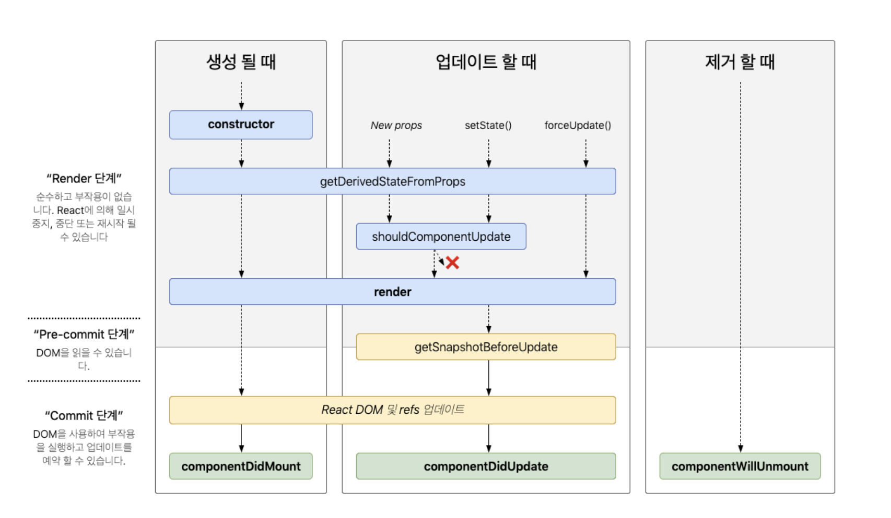

# React 컴포넌트의 생명 주기 (Life Cycle)

리액트 컴포넌트에는 생명 주기가 있다. 
그리고 이것을 라이프사이클(Life cycle)이라고 많이 표현한다. 

라이프 사이클은 컴포넌트가 실행되거나, 업데이트 또는 제거될 때 특정한 이벤트들을 호출하는 것입니다.

이러한 리액트의 라이프 사이클은 클래스 컴포넌트에서만 사용할 수 있으며,
함수 컴포넌트에서 사용하고 싶을 경우에는 리액트 훅인 `useEffect`를 이용하여
비슷하게 작업을 할 수가 있다. 

 
: http://projects.wojtekmaj.pl/react-lifecycle-methods-diagram/

### 1️⃣ 마운트
<hr/>

컴포넌트가 처음 실행이 될때 생성단계를 마운트(Mount)라고 표현 

- constructor
- getDerivedStateFromProps
- render
- componentDidMount

### constructor

```jsx
constructor(props) {
  super(props);
  this.state = { counter: 0 };
  // this.setState() 호출은 X
}
```
컴포넌트 생성자 메서드. <br/> 컴포넌트가 생성이 되면 제일 먼저 실행이 되는 메서드<br/>
state와 props를 접근하여 값을 할당 할 수 있음

### getDerivedStateFromProps
```jsx
static getDerivedStateFromProps(props, state)
```
`getDerivedStateFromProps`는 props로 받아온 것을 state에 설정하고 싶을 때 사용<br/>
최초 마운트 시와 갱신 시,모두에서 render 메서드를 호출하기 직전에 호출.<br/>
특정 객체를 반환하게 되면 해당 객체의 값이 state로 갱신,
null을 반환하게 되면 아무 것도 갱신하지 않을 수 있음

### render
```jsx
render()
```
render()은 컴포넌트를 렌더링 해주는 메서드<br/>
클래스 컴포넌트에서 반드시 구현돼야하는 유일한 메서드

### componentDidMount
```jsx
componentDidMount()
```
컴포넌트가 마운트, 첫번째 렌더링이 된 직후 호출되는 메서드<br/>
이 시점에는 화면이 구현이 되어있는 상태<br/>
`componentDidMount`에서는 DOM에 접근하여 사용 가능<br/>
그래서 여기에서는 주로 AJAX 요청을 하거나,DOM에 속성을 읽거나 변경을 하는 작업<br/>
(setTimeout, setInterval 등등)


### 2️⃣ 업데이트
<hr/>

컴포넌트의 업데이트 시에는 다음과 같은 생명주기의 메서드들이 호출

- getDerivedStateFromProps
- shouldComponentUpdate
- render
- getSnapshotBeforeUpdate
- componentDidUpdate

### getDerivedStateFromProps
`getDerivedStateFromProps`는 값이 갱신되어 업데이트 시에도
render 전에 메서드가 실행

### shouldComponentUpdate
```jsx
shouldComponentUpdate(nextProps, nextState)
```

컴포넌트를 다시 리렌더링 할지 말지 결정하는 메서드<br/>
props 또는 state가 새로운 값으로 갱신되어서 렌더링이 발생하기 직전에 호출<br/>
기본값은 true이며, return false를 하면 render을 취소 ㄱㄴ<br/>
그래서 주로 성능최적화를 위해 사용이 

### render
렌더링 

### getSnapshotBeforeUpdate
```jsx
getSnapshotBeforeUpdate(prevProps, prevState)
```
가장 마지막으로 렌더링된 결과가 DOM 등에 반영되기 전에 호출 <br/>
이 메서드를 사용을 하면 DOM 상태가 변경이 되기전의 값을 반환,<br/>
componentDidUpdate에서 인자로 받아서 사용이 가능

### componentDidUpdate
```jsx
componentDidUpdate(prevProps, prevState) {}

componentDidUpdate(prevProps) {
  // 전형적인 사용 사례 (props 비교를 잊지 마세요)
  if (this.props.userID !== prevProps.userID) {
    this.fetchData(this.props.userID);
  }
}
```
`componentDidUpdate()`는 갱신이 일어난 직후에 호출 <br/>
이 메서드는 최초 렌더링에서는 호출 X


### 3️⃣ 언마운트
<hr/>

컴포넌트가 화면에서 제거 되는것을 의미, <br/>
관련된 생명주기 메서드는 componentWillUnmount 하나

### componentWillUnmount
```jsx
componentWillUnmount()
```
컴포넌트가 사라지기 직전에 호출 <br/>
주로 여기서는 DOM에 등록했었던 이벤트들을 제거해주는 용도로 사용

